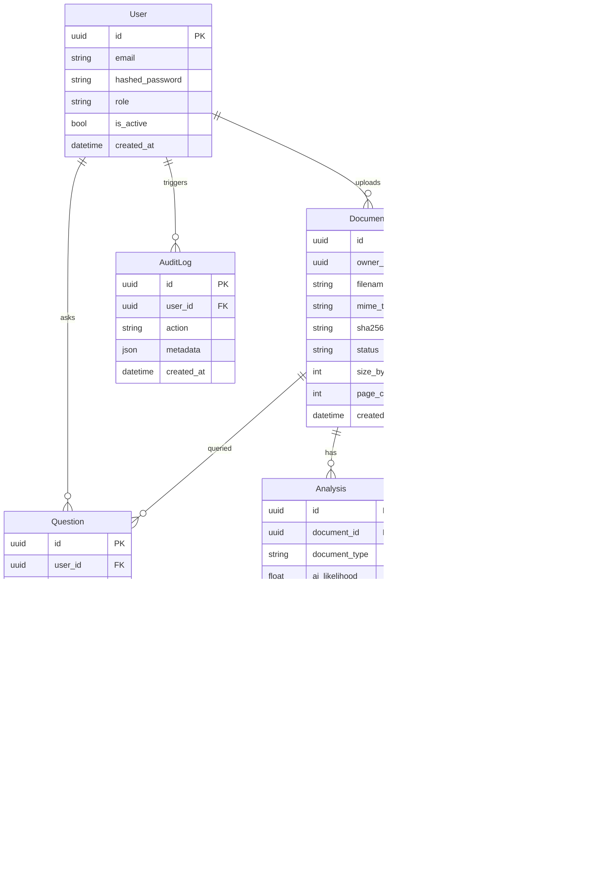

# Database Entity Diagram

```mermaid
erDiagram
  User ||--o{ Document : uploads
  User ||--o{ Question : asks
  User ||--o{ AuditLog : triggers
  Document ||--o{ Analysis : has
  Document ||--o{ DocumentChunk : contains
  Document ||--o{ Question : queried
  Question ||--o{ Answer : receives
  DocumentChunk ||--o{ Answer : cites

  User {
    uuid id PK
    string email
    string hashed_password
    string role
    bool is_active
    datetime created_at
  }

  Document {
    uuid id PK
    uuid owner_id FK
    string filename
    string mime_type
    string sha256
    string status
    int size_bytes
    int page_count
    datetime created_at
  }

  Analysis {
    uuid id PK
    uuid document_id FK
    string document_type
    float ai_likelihood
    string confidence
    json signals
    json extracted_fields
    datetime created_at
  }

  DocumentChunk {
    uuid id PK
    uuid document_id FK
    int chunk_index
    int page_number
    string text
    string vector_id
  }

  Question {
    uuid id PK
    uuid user_id FK
    uuid document_id FK
    string question
    datetime created_at
  }

  Answer {
    uuid id PK
    uuid question_id FK
    string answer
    float confidence
    json citations
    datetime created_at
  }

  AuditLog {
    uuid id PK
    uuid user_id FK
    string action
    json metadata
    datetime created_at
  }
```
